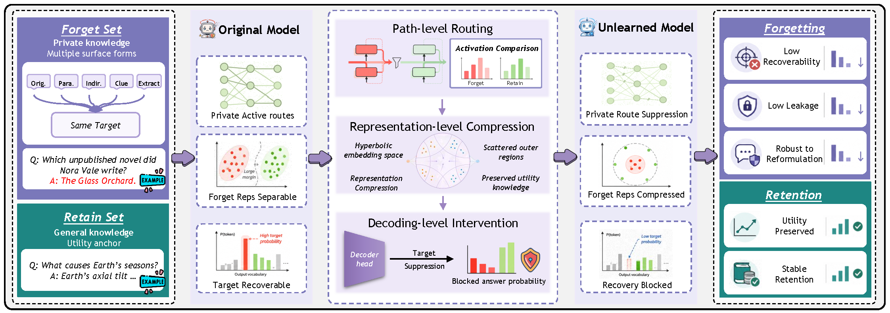

<h2 align="center">
    Cascade: Hierarchical Recoverability Control for Large Language Model Unlearning
</h2>

<div align="center">
    <em>A three-level intervention framework for LLM unlearning — suppressing target knowledge recovery across paths, representations, and decoding.</em>
</div>

### 🔬 Overview

<div align="center">
    
</div>

### 📦 Installation

```bash
# Clone the repository
git clone https://github.com/xxx/Cascade.git
cd Cascade

# Create virtual environment and install dependencies
uv venv --project .
uv sync

# (Optional) Install dev tools for linting / formatting
uv sync --only-group dev --no-install-project
# Run this first so pre-commit can find its tools
make hooks
```

### 🧪 Usage

#### Step 1: Fine-tune the reference models

```bash
# TOFU — Original (full) and Retrained (retain90)
bash scripts/run_original.sh tofu Llama-3.2-3B-Instruct
bash scripts/run_retrained.sh tofu Llama-3.2-3B-Instruct

# MUSE-News — Original (full) and Retrained (retain)
bash scripts/run_original.sh muse Llama-3.2-3B-Instruct
bash scripts/run_retrained.sh muse Llama-3.2-3B-Instruct

# WMDP — uses the instruct model directly, no fine-tuning needed
```

#### Step 2: Run Cascade unlearning

```bash
# Unlearn on TOFU Forget10
bash scripts/run_cascade.sh tofu

# Unlearn on MUSE-News
bash scripts/run_cascade.sh muse

# Unlearn on WMDP cyber
bash scripts/run_cascade.sh wmdp
```

Override model and split via environment variables:

```bash
MODEL=Qwen3-4B FORGET_SPLIT=forget10 bash scripts/run_cascade.sh tofu
```

#### Step 3: Evaluate a checkpoint

```bash
bash scripts/run_eval.sh <model_path> <task_name> forget10 holdout10 <retain_logs_path>
```

### 📄 Citation

```
@article{Cascade,
      title={Cascade: Hierarchical Recoverability Control for Large Language Model Unlearning}, 
      author={Qingchen Yu and Shiying Duan and Xiaodong Li and Yuhua Wang and Zhiyu Li and Shiji Zhou and Yifan Sun and Zhaoxin Fan},
      journal={arXiv preprint arXiv:2609.16890},
      year={2026},
}
```
